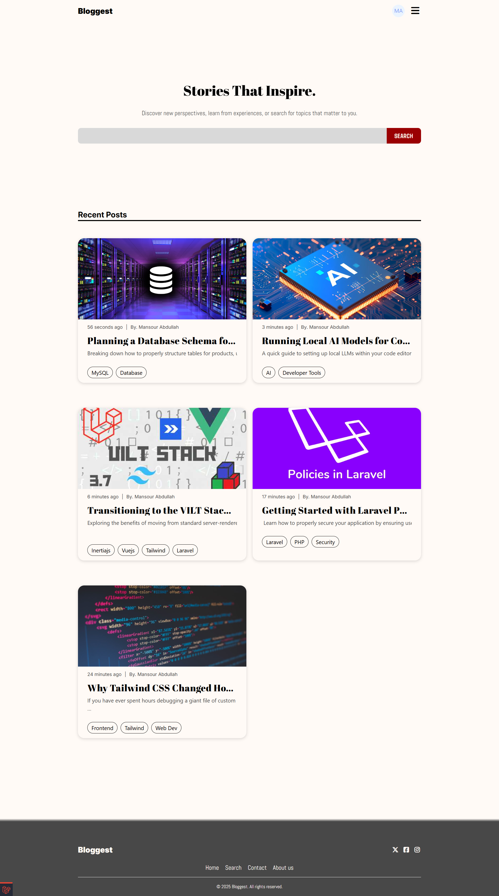
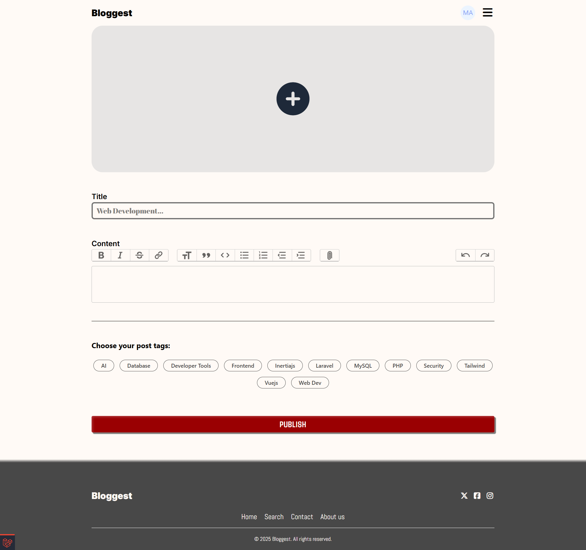
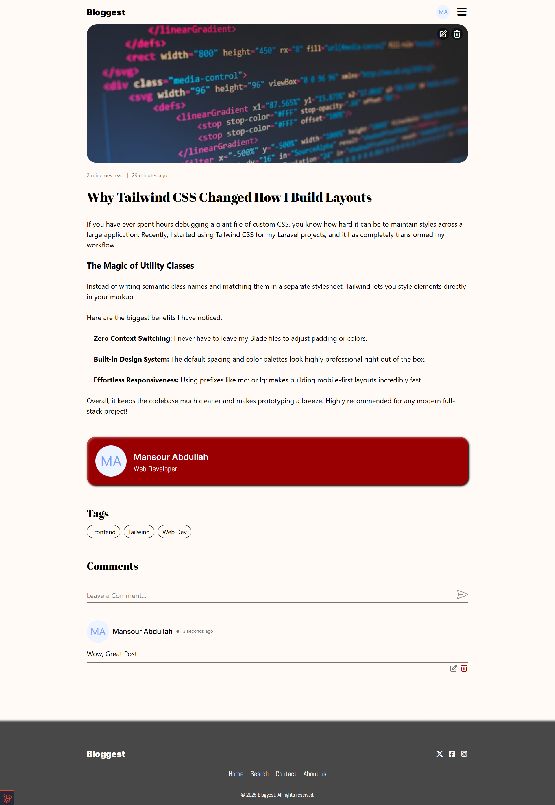
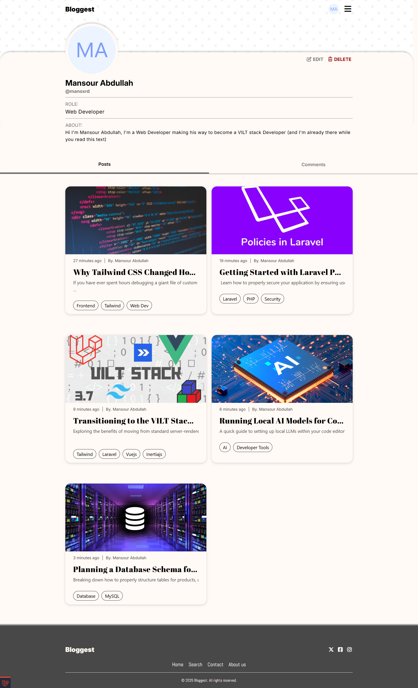

# Bloggest

A full-stack blogging platform built with Laravel. Users can publish rich-text posts, tag content, comment, like posts, and manage public profiles.

---

## Screenshots

<details>
<summary><b>Click to view platform screenshots</b></summary>
<br>

**Homepage & Feed**


**Rich Text Editor**


**Post View & Comments**


**Public User Profile**


</details>

---

## Features

- **Authentication** — Register, login, logout, forgot password, reset password
- **Posts** — Create, edit, and delete posts with Trix rich-text editor and image attachments
- **Profiles** — Public profiles at `/@username` with bio, avatar, and headline
- **Engagement** — Likes, nested comments (edit/delete own comments), post view tracking
- **Discovery** — Search, tag filtering, blog listing, reading time estimate
- **Authorization** — Laravel policies and gates (users can only edit their own content)
- **Security** — User-generated HTML sanitized with Symfony HTML Sanitizer before display

---

## Tech stack

| Layer | Technology |
|-------|------------|
| Backend | PHP 8.3+, Laravel 13 |
| Database | MySQL (configurable via `.env`) |
| Frontend | Blade, Tailwind CSS v4, Vite |
| Rich text | [Rich Text Laravel](https://github.com/tonysm/rich-text-laravel) + Trix |
| Tooling | Laravel Pint, Laravel Herd (local) |

---

## Requirements

- PHP 8.3 or higher
- Composer
- Node.js 18+ and npm
- MySQL (or change `DB_*` in `.env` to SQLite if you prefer)

---

## Installation

### 1. Clone the repository

```bash
git clone https://github.com/manoxrd/bloggest.git
cd bloggest
```

### 2. Install dependencies

```bash
composer install
npm install
```

### 3. Environment setup

```bash
cp .env.example .env
php artisan key:generate
```

Edit `.env` and set your database credentials:

```env
APP_NAME=Bloggest
APP_URL=http://bloggest.test

DB_CONNECTION=mysql
DB_DATABASE=bloggest
DB_USERNAME=root
DB_PASSWORD=your_password
```

Create the database (e.g. `bloggest`) in MySQL before migrating.

### 4. Database and storage

```bash
php artisan migrate
php artisan storage:link
```

### 5. Frontend assets

For development (hot reload):

```bash
npm run dev
```

For production build:

```bash
npm run build
```

### Quick setup (one command)

If you prefer, Composer can run the main setup steps:

```bash
composer run setup
```

---

## Running locally with Laravel Herd

If you use [Laravel Herd](https://herd.laravel.com/), the site is available at:

**http://bloggest.test**

No `php artisan serve` is required.

---

## Main routes

| URL | Description |
|-----|-------------|
| `/` | Homepage (latest posts) |
| `/blog` | All posts |
| `/search` | Search posts |
| `/register`, `/login` | Guest auth |
| `/@username` | User profile |
| `/@username/post-slug` | Single post |

---

## Project structure (high level)

```
app/
├── Http/Controllers/   # Request handling
├── Models/             # Post, User, Comment, Tag, Like, View
├── Policies/           # Authorization rules
├── Events/             # e.g. post view tracking
└── Support/helpers.php # HTML sanitization (clean())

resources/views/        # Blade templates and components
database/migrations/    # Schema
```

---

## What I learned

- Building multi-model relationships in Eloquent (posts, tags, comments, likes)
- Authorization with policies and route model binding (`/@user/{post}`)
- Integrating a rich-text editor and moving uploaded attachments from temp to permanent storage
- Sanitizing user HTML to reduce XSS risk
- Structuring Blade components for a consistent UI

---

## License

This project is open-sourced software licensed under the [MIT license](https://opensource.org/licenses/MIT).

---

## Author

**Mansour Abdullah** — [GitHub](https://github.com/manoxrd) · [LinkedIn](https://www.linkedin.com/in/mansour-abdullah-667271336/) · [X](https://x.com/ManoXRD)

Built as a portfolio project while learning Laravel.
